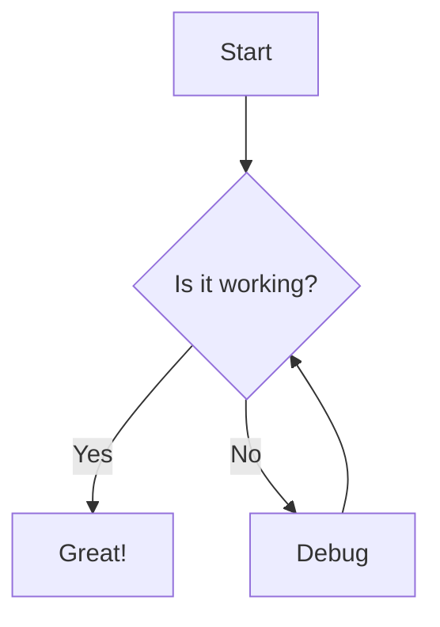
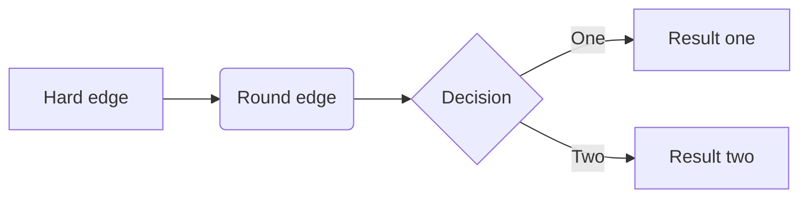
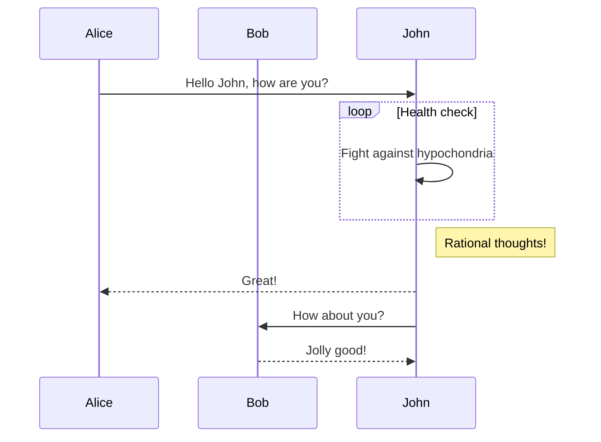
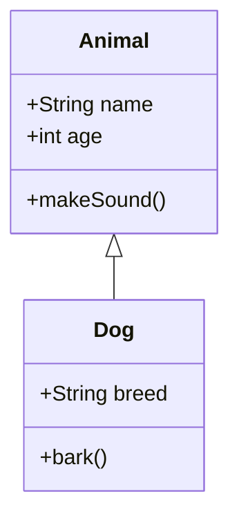
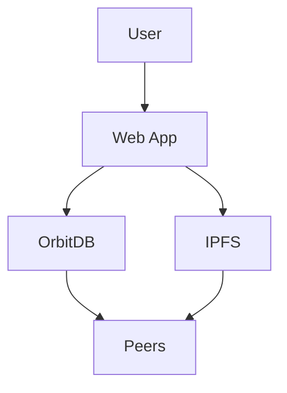
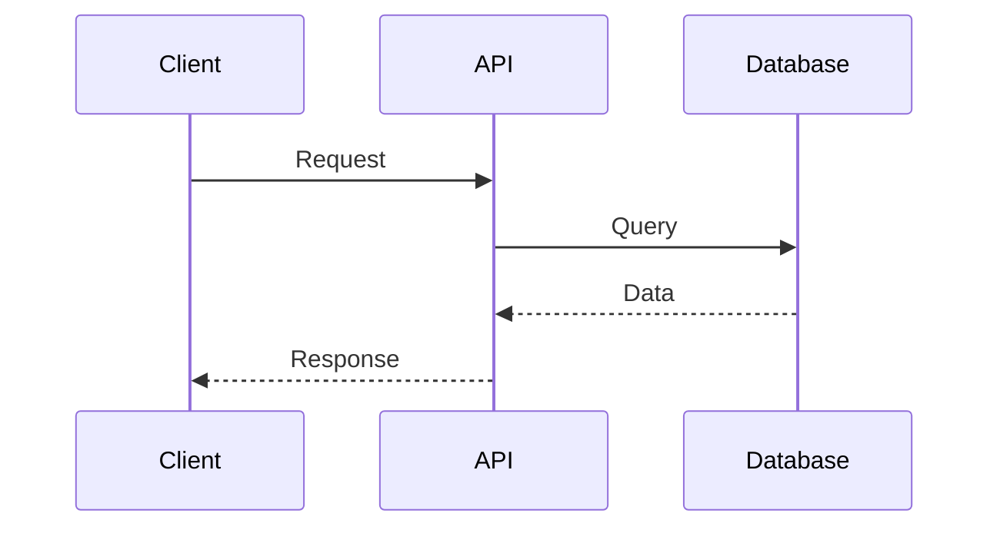

# Le Space Blog Markdown Guide

Welcome to the comprehensive guide for using Markdown in Le Space Blog! This local-first, peer-to-peer blog platform supports standard Markdown plus several powerful custom extensions.

## 📝 Standard Markdown Support

Le Space Blog supports all standard Markdown features:

### Headers
```markdown
# H1 Header
## H2 Header  
### H3 Header
#### H4 Header
##### H5 Header
###### H6 Header
```

### Text Formatting
```markdown
**Bold text**
*Italic text*
~~Strikethrough text~~
`Inline code`
```

### Lists
```markdown
- Unordered list item
- Another item
  - Nested item

1. Ordered list item
2. Another ordered item
   1. Nested ordered item
```

### Links and Images
```markdown
[Link text](https://example.com)

```

### Code Blocks
````markdown
```javascript
function hello() {
    console.log("Hello, World!");
}
```
````

### Blockquotes
```markdown
> This is a blockquote
> 
> It can span multiple lines
```

### Tables
```markdown
| Column 1 | Column 2 | Column 3 |
|----------|----------|----------|
| Cell 1   | Cell 2   | Cell 3   |
| Cell 4   | Cell 5   | Cell 6   |
```

---

## 🚀 Custom Extensions

Le Space Blog includes several powerful custom extensions that enhance your blogging experience:

### 1. 📁 Accordion Extension

Create collapsible content sections using the `----` syntax:

```markdown
----
## Section Title
This content will be collapsible. You can include any markdown here:
- Lists
- **Bold text**
- `Code snippets`
- Even images and links!
----
```

**Result:** Creates an expandable/collapsible section with "Section Title" as the header.

#### Multiple Accordions
```markdown
----
## Installation Guide
Step-by-step installation instructions here...
----

----
## Configuration
Configuration details here...
----

----
## Troubleshooting
Common issues and solutions...
----
```

### 2. 🌐 Remote Markdown Import

Import markdown content from remote sources using the `@import[URL]` syntax:

```markdown
# My Blog Post

Here's some content from a remote GitHub repository:

@import[https://raw.githubusercontent.com/user/repo/main/README.md]

And here's more of my local content.
```

#### Supported Sources
- ✅ GitHub: `https://raw.githubusercontent.com/username/repo/branch/file.md`
- ✅ GitHub Gists: `https://gist.githubusercontent.com/username/gist-id/raw/file.md`
- ✅ GitLab: `https://gitlab.com/username/project/-/raw/branch/file.md`
- ✅ Bitbucket: `https://bitbucket.org/username/repo/raw/branch/file.md`

#### Features
- 🔄 Automatic caching (5 minutes)
- 🔐 Security-first (only whitelisted domains)
- 🎨 Visual loading indicators
- ❌ Graceful error handling
- 📱 Mobile-friendly

**[→ Full Remote Import Documentation](./REMOTE_MARKDOWN_IMPORT.md)**

### 3. 📊 Mermaid Diagrams

Create diagrams and charts using Mermaid syntax:

````markdown

````

#### Flowcharts
````markdown

````

#### Sequence Diagrams
````markdown

````

#### Class Diagrams
````markdown

````

### 4. 🖼️ IPFS Image Support

Display images stored on IPFS using the `ipfs://` protocol:

```markdown

```

#### Features
- 🔄 Automatic fetching from local Helia node
- 🌐 Fallback to IPFS gateways
- ⚡ Caching for performance
- 📱 Loading placeholders

### 5. 🎥 Enhanced Media Embedding

Embed videos and media from trusted platforms:

```markdown
<!-- YouTube -->
<iframe src="https://www.youtube.com/watch?v=VIDEO_ID"></iframe>

<!-- Vimeo -->  
<iframe src="https://player.vimeo.com/video/VIDEO_ID"></iframe>

<!-- Other supported platforms -->
<iframe src="https://player.bilibili.com/player.html?bvid=VIDEO_ID"></iframe>
```

#### Supported Platforms
- 🎥 YouTube (`youtube.com`, `youtu.be`, `youtube-nocookie.com`)
- 🎬 Vimeo (`player.vimeo.com`)
- 📺 Dailymotion (`www.dailymotion.com`)
- 🌏 International: Bilibili, Youku, Niconico, RuTube, and more

---

## 🎨 Advanced Styling

### Custom CSS Classes

Le Space Blog uses TailwindCSS. You can apply classes to elements:

```html
<div class="bg-blue-100 p-4 rounded-lg">
    This is a styled box with blue background and padding.
</div>
```

### Dark Mode Support

All markdown content automatically adapts to dark/light themes. Custom elements include dark mode variants:

```html
<div class="bg-gray-100 dark:bg-gray-800 text-gray-900 dark:text-white">
    This adapts to dark mode automatically!
</div>
```

---

## 💡 Best Practices

### 1. **Performance Tips**
- Keep remote imports to reasonable file sizes
- Use IPFS for images when possible (better for decentralization)
- Cache frequently accessed remote content

### 2. **Security Considerations**
- Only use trusted sources for remote imports
- Be aware that remote content can change without notice
- Always preview your content before publishing

### 3. **Accessibility**
- Always include alt text for images
- Use semantic heading structure (H1 → H2 → H3)
- Provide meaningful link text

### 4. **Organization**
- Use accordions for long content sections
- Break up long posts with headers and sections
- Use diagrams to explain complex concepts

### 5. **Local-First Philosophy**
- Remember that remote imports require internet connectivity
- Consider copying important content locally
- Use IPFS for permanent content storage

---

## 🔧 Technical Details

### Processing Order
1. **Standard Markdown** parsing (headers, lists, links, etc.)
2. **Custom Extensions** (accordions, remote imports)
3. **Code Blocks** (including Mermaid)
4. **Media Processing** (IPFS images, iframe validation)
5. **Security Sanitization** (DOMPurify)

### Browser Compatibility
- Modern browsers with JavaScript enabled
- Progressive Web App (PWA) support
- Mobile-responsive design
- Offline functionality (for cached content)

### Security Features
- Content Security Policy (CSP) compliance
- XSS protection via DOMPurify
- Domain whitelisting for remote content
- Sandboxed iframes

---

## 📚 Examples Gallery

### Blog Post Structure
```markdown
# My Amazing Blog Post

A brief introduction to what this post covers.

## Overview

@import[https://raw.githubusercontent.com/myproject/docs/main/overview.md]

## Technical Details  

----
### Configuration
Here's how to configure the system:

```json
{
  "setting": "value",
  "enabled": true
}
```
----

----
### Architecture
Here's the system architecture:


----

## Media Examples


## Conclusion

That's all folks! 🚀
```

### Documentation Template
```markdown
# Project Documentation

Welcome to our project! Here's everything you need to know.

----
## Quick Start
@import[https://raw.githubusercontent.com/project/main/docs/quickstart.md]
----

----
## API Reference  
@import[https://raw.githubusercontent.com/project/main/docs/api.md]
----

----
## Examples
### Basic Usage
```javascript
const client = new ProjectClient();
await client.connect();
```

### Advanced Usage

----

## Support

Need help? [Contact us](mailto:support@example.com)
```

---

## 🆘 Troubleshooting

### Common Issues

**Accordion not working?**
- Make sure to use exactly `----` (4 dashes)
- Include a header line after the opening `----`
- Close with another `----`

**Remote import failing?**  
- Check if the URL is accessible in your browser
- Verify the domain is whitelisted
- Wait for loading indicator to complete

**Mermaid diagram not rendering?**
- Ensure the code block language is set to `mermaid`
- Check diagram syntax at [mermaid.live](https://mermaid.live)
- Verify JavaScript is enabled

**IPFS images not loading?**
- Check if the CID is valid
- Wait for IPFS network propagation
- Verify Helia node is running

### Getting Help

1. Check browser developer console for errors
2. Test with simplified content
3. Verify internet connectivity for remote features
4. Clear browser cache if needed

---

## 🔄 Updates and Changelog

This guide covers all current markdown extensions. New features are added regularly:

- ✅ **v0.2.96**: Added remote markdown import (`@import`)
- ✅ **Previous**: Accordion extension (`----`)  
- ✅ **Previous**: Mermaid diagram support
- ✅ **Previous**: IPFS image integration
- ✅ **Previous**: Enhanced media embedding

---

*This guide is part of Le Space Blog - a local-first, peer-to-peer blogging platform powered by OrbitDB and IPFS. 🚀*
