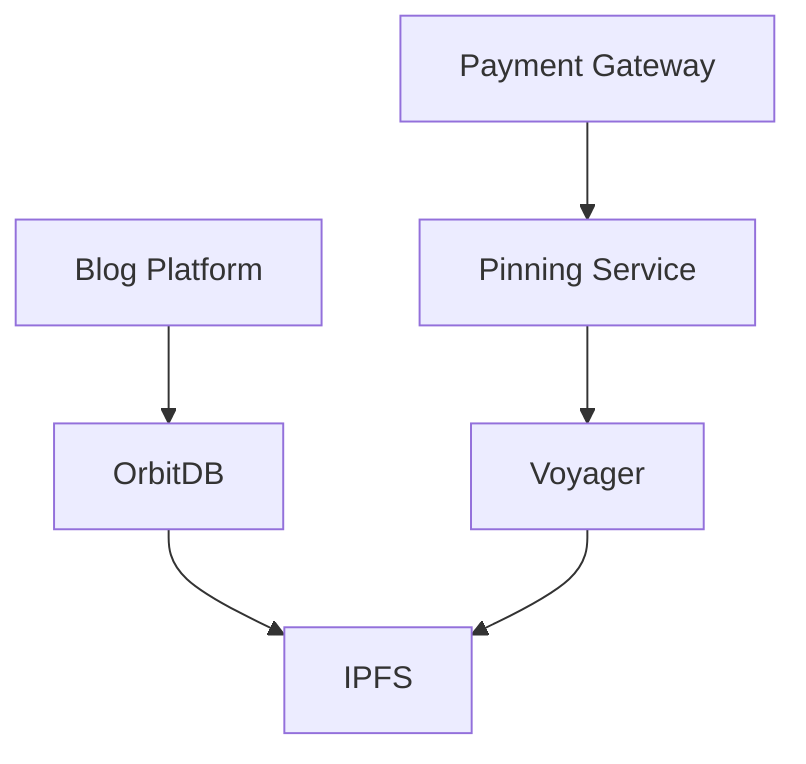
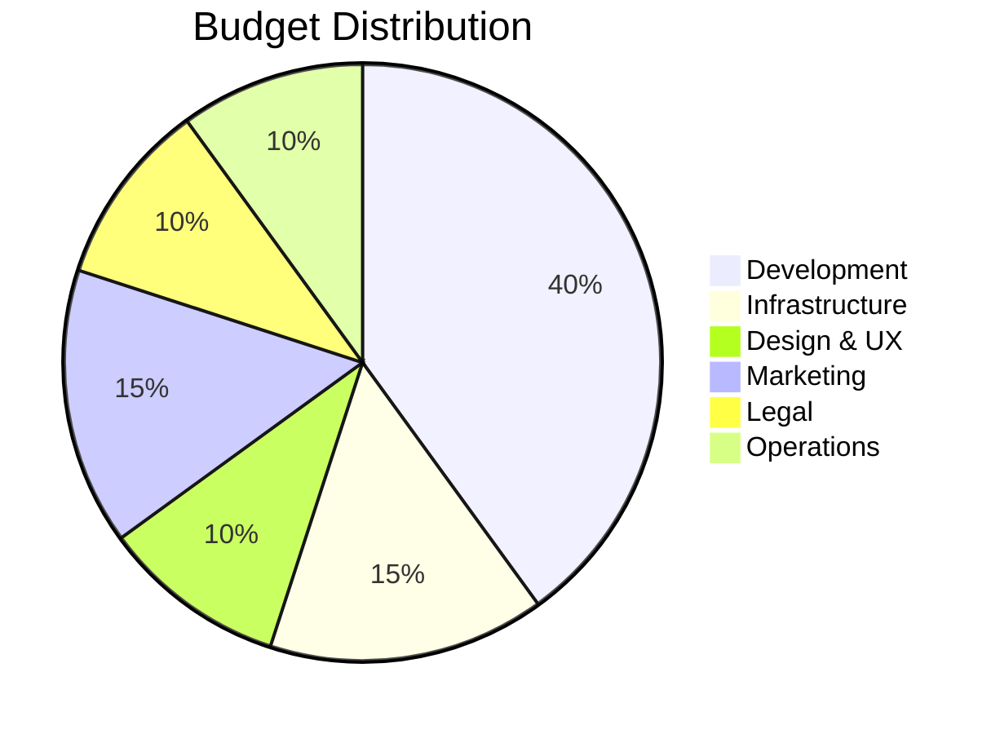

# DecentraSol
## Decentralized Content Infrastructure
### Investment Pitch Deck

---

## Executive Summary

DecentraSol is building the future of decentralized content infrastructure, combining the power of peer-to-peer technology with enterprise-grade reliability. We're seeking $2M in seed funding to scale our platform and pinning services.

---

## The Problem

Content creators and enterprises face critical challenges:

* 🔒 Platform lock-in and censorship risks
* 💾 Loss of data ownership and control
* ⚠️ Single points of failure in content hosting
* 🌐 No blockchain-agnostic content solutions
* 💸 High costs of decentralized storage

---

## Our Solution

DecentraSol provides a comprehensive decentralized content ecosystem:

* 📝 **Local-First Blog Platform**
  - Full data ownership
  - Offline-first capability
  - Blockchain agnostic
  
* 🔗 **Enterprise Pinning Service**
  - High availability
  - Professional SLAs
  - Fiat payment gateway

---

## Market Opportunity

### Target Markets

* 🏢 Crypto Projects & DAOs
* 🛡️ Privacy-focused Enterprises
* ✍️ Web3 Content Creators
* 🌱 Traditional Business Migration

### Market Size
* TAM: $15B by 2025
* SAM: $3B
* SOM: $300M

---

## Technology Stack

* **Core:** OrbitDB, IPFS
* **Pinning:** Voyager Infrastructure
* **Enterprise:** Custom Dashboard
* **Payments:** Fiat Gateway

---

## Business Model

### Revenue Streams

1. **Enterprise Pinning Service**
   * Basic: $99/mo
   * Professional: $499/mo
   * Enterprise: Custom

2. **Professional Services**
   * Implementation
   * Migration
   * Training
   * Support

---

## Funding Requirements ($2M)

### 18-Month Budget Allocation

---

## Timeline & Milestones

### Phase 1 (Months 1-6)
* Core team assembly
* Infrastructure deployment
* MVP pinning service
* Basic fiat gateway

### Phase 2 (Months 7-12)
* Enhanced monitoring
* Multi-region support
* Enterprise features
* Marketing launch

### Phase 3 (Months 13-18)
* Decentralized protocol
* Partner integrations
* International expansion
* Community scaling

---

## Competitive Advantage

* 🥇 First-mover advantage
* 🏢 Enterprise-grade reliability
* 💻 Local-first architecture
* 👥 Open-source community
* 🛠️ Technical excellence

---

## Team

* **CEO/Technical Founder**
  - 15 years in distributed systems
  - Previous successful exits

* **CTO/Architecture Lead**
  - OrbitDB contributor
  - P2P systems expert

* **Head of Business Development**
  - Enterprise sales background
  - Web3 ecosystem connections

*(Additional key positions to be filled with funding)*

---

## Traction

* 🚀 X active installations
* 📝 Y blog posts created
* 💼 Z enterprise inquiries
* 🌱 Growing open-source community
* 👥 Early adopter partnerships

---

## Use of Funds

### Development ($800K)
* 3 Senior Backend Developers
* 2 Frontend Developers
* 1 DevOps Engineer
* 1 Technical Lead

### Infrastructure ($300K)
* Server fleet
* CDN setup
* Security systems
* Monitoring tools

### Design & UX ($200K)
* UI/UX Designer
* Product Designer
* User research
* Design system

### Marketing & BD ($300K)
* Content marketing
* Developer relations
* Conference presence
* Community building

### Legal & Compliance ($200K)
* Legal structure
* Regulatory compliance
* IP protection

### Operations ($200K)
* Office space
* Tools & software
* Emergency fund

---

## Exit Strategy

### Acquisition Targets
* Web3 infrastructure companies
* Content delivery networks
* Enterprise software providers

### IPO Path
* Infrastructure as a Service
* Content delivery platform
* Enterprise data solution

---

## Contact

[Your Contact Information]
[Company Website]
[Email]
[Social Media]

---

## Appendix

* Technical Architecture
* Market Research
* Financial Projections
* Customer Testimonials
* Partnership Details
